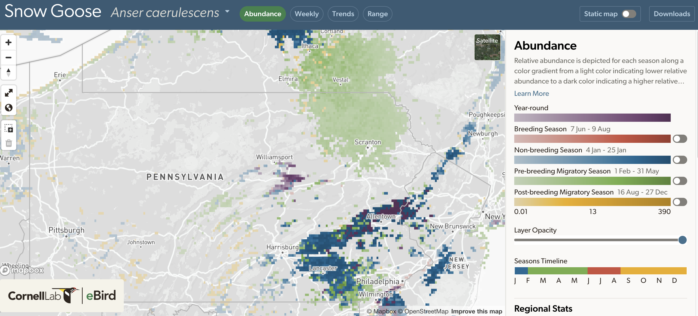

# Intro

The motivation for this post is to see if it is possible to use bird species abundance across space to infer types of habitat. I will use bird species abundance rasters to create clusters in an unsupervised learning context. I focus on Pennsylvania because that is habitat I am personally familiar with, but the approach could be generalized to other areas that the data has been collected for.

# Get data from {ebirdst}

The species abundance data I use is from the [{ebirdst}](https://ebird.github.io/ebirdst/) package. There is a great series of tutorial [videos on Youtube](https://www.youtube.com/watch?v=DWqgbsMH1yU) that explain the underlying theory and application. The TLDR is that the authors use citizen science observations from eBird, temporal data, and environmental data (geographic indicators such as elevation, topography, and land cover) to predict the relative abundance of many bird species across space and time. While there is some risk of circular logic here (using estimates partially based on environmental data to make inferences about the environment), I think the signal in spatiotemporal patterns of bird abundance adds enough extra information to justify the approach.

The full paper behind the estimates is available [here](https://esajournals.onlinelibrary.wiley.com/doi/10.1002/eap.2056).

>Matthew Strimas-Mackey, Shawn Ligocki, Tom Auer, Daniel Fink (2023). ebirdst: Access and Analyze eBird Status and Trends Data Products. R package version 3.2022.0. https://ebird.github.io/ebirdst/

For this analysis I focus on the proportion of the population for a given species in a 3x3 kilometer area. For example, if 10% of the Pennsylvania population of Yellow Warbler exist in 3x3 km tile "A", that tile's proportion of population for that species is 10%. I focus on migratory birds that the Cornell team has high confidence estimates for.

I wrote a [convenience function](https://github.com/conorotompkins/ebird/blob/master/scripts/pull_ebirdst_metrics.R) to handle the process of getting the data and subsetting it to my area of interest. The process is:

-   Download the raster data for the entire world
-   Crop and mask the raster to just Pennsylvania
-   Calculate the proportion of the Pennsylvania population that each tile represents for a given species + week of the year
-   Since the rasters have multiple layers for each week of the year, I take the highest value for the entire year for each raster tile. This means that each abundance estimate represents the maximum proportion of population for that species across the year for a given tile.

# Organize data

```{r load packages}
library(tidyverse)
library(sf)
library(broom)
library(parsnip)
library(tidyclust)
library(factoextra)
library(clValid)
library(tune)
library(gt)
library(ggrepel)
library(patchwork)
library(GGally)
library(hrbrthemes)
library(scales)
library(viridis)

options(scipen = 999, digits = 4)

theme_set(theme_bw())

set.seed(1234)
```

```{r read data}
bird_df_raw <- read_csv("post_data/species_abundance_present_in_pa.csv") |>
  rename(prop_pop_max = prop_pop)

glimpse(bird_df_raw)

distinct_species <- bird_df_raw |> 
  distinct(common_name) |> 
  nrow()

distinct_tiles <- bird_df_raw |> 
  distinct(x, y) |> 
  nrow() |> 
  comma()
```

There are `r distinct_species` distinct species across `r distinct_tiles` distinct tiles in the dataset.

# Exploratory data analysis

## Problem of scale

While the distribution of some birds' abundance across space is normally distributed, some distributions are extremely skewed. This makes it more difficult to analyze across species.

```{r calc metrics}
bird_df_scale_compare <- bird_df_raw |> 
  mutate(scaled = prop_pop_max |> scale() |> as.numeric(),
         rescaled = prop_pop_max |> rescale(to = c(-1, 1)),
         log = log(prop_pop_max + 1),
         log10 = log10(prop_pop_max + 1),
         .by = common_name) |> 
  rename(original_scale = prop_pop_max)
```

This shows the distribution of various species' abundance, transformed various ways to attempt to normalize the skewed distributions. Unfortunately the species with more skew in their distribution are extremely zero-inflated, i.e. there are many values of 0 abundance.

These transformations are not very effective with this type of skew. Using a scale function to transform the data relative to its mean is not effective for zero-inflated data because the mean is very close to the lower limit (0) of the data. While the maps that use `scaled` and `rescaled` may look "better", I don't think the output is statistically sensible.

```{r compare scales}
#| fig-height: 10

test_sp <- c("Dark-eyed Junco", "Yellow Warbler", "Snow Goose")

bird_df_scale_compare <- bird_df_scale_compare |> 
  filter(common_name %in% test_sp) |> 
  select(common_name, x, y, original_scale, scaled, rescaled, log, log10) |> 
  pivot_longer(cols = c(original_scale, scaled, rescaled, log, log10)) |> 
  mutate(name = factor(name, levels = c("original_scale", "scaled", "rescaled", "log", "log10")))

graph_abundance <- function(x, y){
  
  x |> 
    ggplot(aes(value, fill = name)) +
    geom_density() +
    facet_wrap(vars(name), ncol = 5, scales = "free") +
    scale_x_continuous(labels = NULL) +
    scale_y_continuous(labels = NULL) +
    labs(title = y)
  
}

bird_df_scale_compare |> 
  group_nest(common_name) |> 
  mutate(plot = map2(data, common_name, graph_abundance)) |> 
  pull(plot) |> 
  wrap_plots(ncol = 1, guides = "collect")
```

```{r}
bird_df_scale_compare |>
  pivot_wider(names_from = name, values_from = value) |> 
  filter(common_name %in% test_sp) |> 
  ggplot(aes(x, y, fill = original_scale)) +
  geom_tile() +
  facet_wrap(vars(common_name), ncol = 1) +
  scale_fill_viridis_c() +
  coord_fixed() +
  labs(title = "Original scale") +
  theme_void()
```

```{r}
bird_df_scale_compare |>
  pivot_wider(names_from = name, values_from = value) |> 
  filter(common_name %in% test_sp) |> 
  ggplot(aes(x, y, fill = scaled)) +
  geom_tile() +
  facet_wrap(vars(common_name), ncol = 1) +
  scale_fill_viridis_c() +
  coord_fixed() +
  labs(title = "Scaled") +
  theme_void()
```

```{r}
bird_df_scale_compare |>
  pivot_wider(names_from = name, values_from = value) |> 
  filter(common_name %in% test_sp) |> 
  ggplot(aes(x, y, fill = rescaled)) +
  geom_tile() +
  facet_wrap(vars(common_name), ncol = 1) +
  scale_fill_viridis_c() +
  coord_fixed() +
  labs(title = "Rescaled") +
  theme_void()
```

```{r}
bird_df_scale_compare |>
  pivot_wider(names_from = name,
              values_from = value) |> 
  filter(common_name %in% test_sp) |> 
  ggplot(aes(x, y, fill = log)) +
  geom_tile() +
  facet_wrap(vars(common_name), ncol = 1) +
  scale_fill_viridis_c() +
  coord_fixed() +
  labs(title = "log scale") +
  theme_void()
```

```{r}
bird_df_scale_compare |>
  pivot_wider(names_from = name, values_from = value) |> 
  filter(common_name %in% test_sp) |> 
  ggplot(aes(x, y, fill = log10)) +
  geom_tile() +
  facet_wrap(vars(common_name), ncol = 1) +
  scale_fill_viridis_c() +
  coord_fixed() +
  labs(title = "log10 scale") +
  theme_void()
```

I ended up choosing the `log10` transformation, but more testing would be needed to really justify this choice.
```{r}
bird_df <- bird_df_raw |> 
  mutate(prop_pop_max_log10 = log10(prop_pop_max + 1),
         .by = common_name) |> 
  select(common_name, x, y, prop_pop_max_log10)

bird_df_wide <- bird_df |> 
  pivot_wider(names_from = common_name, values_from = prop_pop_max_log10)

bird_df_wide_noloc <- select(bird_df_wide, -c(x, y))
```

The Snow Goose in Pennsylvania is a good example of a highly zero-inflated distribution because it is either absent or hugely abundant, and only in specific areas.

[](https://science.ebird.org/en/status-and-trends/species/snogoo/abundance-map)

One Snow Goose:

<iframe src="https://macaulaylibrary.org/asset/290513131/embed" height="509" width="700" frameborder="0" allowfullscreen></iframe>

Many Snow Geese:

<iframe src="https://macaulaylibrary.org/asset/614961086/embed" height="509" width="640" frameborder="0" allowfullscreen></iframe>

Snow Goose make distribution skew go brrrrrrrrrr

My potato photo, to calibrate your expections of my photography skills:

<iframe src="https://macaulaylibrary.org/asset/542945591/embed" height="357" width="640" frameborder="0" allowfullscreen></iframe>

# Clustering

## Kmeans

First I will use kmeans to cluster the data. This code (adapted from [tidymodels](https://www.tidymodels.org/learn/statistics/k-means/)) calculates the total within sum of squared error across increasing amounts of clusters.

```{r kmeans 1}
nclust_global <- 10

kclusts <- tibble(k = 1:nclust_global) |>
  mutate(
    kclust = purrr::map(k, ~kmeans(bird_df_wide_noloc, .x)),
    tidied = purrr::map(kclust, tidy),
    glanced = purrr::map(kclust, glance),
    augmented = purrr::map(kclust, augment, bird_df_wide)
  )

clusters <- kclusts |>
  unnest(cols = c(tidied))

assignments <- kclusts |>
  unnest(cols = c(augmented))

clusterings <- kclusts |>
  unnest(cols = c(glanced))

ggplot(clusterings, aes(k, tot.withinss)) +
  geom_line() +
  geom_point() +
  scale_x_continuous(breaks = c(1:nclust_global))
```

`tot.withinss` stops decreasing around 4 clusters, which means that the clusters stop becoming significantly more compact after 4 clusters.

This code fits the kmeans algorithm against the data using 4 clusters.

```{r kmeans 2}
nclust_kmeans <- 4

kmeans_spec <- k_means(num_clusters = nclust_kmeans) |> 
  set_engine("stats")

kclust_fit <- kmeans_spec |> 
  fit(~ .,
      data = bird_df_wide_noloc
  )
```

### Metrics

This code calculates the SSE ratio and silhouette score for the clustering. I will use this to compare the performance against hierarchical clustering later.

```{r kmeans 5}
kmeans_summary <- extract_fit_summary(kclust_fit)

dists <- bird_df_wide_noloc |> 
  as.matrix() |> 
  dist()

kmeans_silhouette_score <- silhouette_avg(kclust_fit, dists = dists)

kmeans_metrics <- tibble(algorithm = "kmeans",
                         sse_ratio = sse_ratio(kclust_fit) |> pull(.estimate),
                         silhouette_score = kmeans_silhouette_score |> pull(.estimate))

gt(kmeans_metrics)
```

### Maps

This code creates a map where each tile is colored by the cluster it belongs to. I think kmeans misses a fair amount of the variation in the data. The clusters seem way too general, based on my experience in the regions.
```{r kmeans 7}
cluster_geo <- bird_df_wide |> 
  bind_cols(extract_cluster_assignment(kclust_fit)) |> 
  select(.cluster, everything())

custom_palette_kmeans <- RColorBrewer::brewer.pal(nclust_kmeans, "Paired")

cluster_geo |> 
  ggplot(aes(x, y, fill = .cluster)) +
  geom_tile() +
  scale_fill_manual(values = custom_palette_kmeans) +
  coord_fixed() +
  labs(title = "Types of habitat inferred from species proportion of population",
       subtitle = "Clusters determined by kmeans algorithm",
       caption = "Data from eBird Status and Trends",
       fill = "Cluster") +
  theme_void() +
  theme(plot.background = element_rect(fill = "grey"))
```

-   Cluster 1 indicates fields, forests, and areas with more intensive agriculture.
-   Cluster 2 contains the shoreline of Lake Erie and the Susquehanna River.
-   Cluster 3 indicates the peaks of the Allegheny Mountain Range.
-   Cluster 4 is a unique area in southeastern Pennsylvania that attracts very large flocks of blackbirds.

```{r kmeans 8}
#faceted map
blank_tiles <- bird_df_wide |>
  distinct(x, y)

cluster_geo |> 
  select(x, y, .cluster) |> 
  ggplot(aes(x, y, fill = .cluster)) +
  geom_tile(data = blank_tiles, aes(x, y), fill = "grey", inherit.aes = FALSE) +
  geom_tile() +
  scale_fill_manual(values = custom_palette_kmeans) +
  coord_fixed() +
  labs(title = "Types of habitat inferred from species proportion of population",
       subtitle = "Clusters determined by kmeans algorithm",
       caption = "Data from eBird Status and Trends") +
  guides(fill = "none") +
  facet_wrap(vars(.cluster)) +
  theme_void()
```

Next I will compare the proportion of population for species in each cluster to the statewide average for that species.

```{r kmeans 9}
#compare clusters to global average
global_avg <- bird_df |> 
  summarize(prop_pop_global_mean = mean(prop_pop_max_log10),
            .by = c(common_name))
```

```{r kmeans 10}
centroids_long_kmeans <- kclust_fit |>
  extract_centroids() |> 
  pivot_longer(-.cluster, names_to = "common_name", values_to = "cluster_mean") |> 
  mutate(common_name = str_remove_all(common_name, "\\`"))

centroid_vs_global_kmeans <- centroids_long_kmeans |> 
  left_join(global_avg) |> 
  mutate(diff = cluster_mean - prop_pop_global_mean,
         diff_abs = abs(diff))
```

This table shows which birds are more represented in a cluster compared to the statewide average:

```{r kmeans 11}
#which birds are more common in a cluster than average?
centroid_vs_global_kmeans |> 
  group_by(.cluster) |> 
  slice_max(order_by = diff, n = 5) |> 
  select(.cluster, common_name, diff) |> 
  arrange(.cluster, desc(diff)) |> 
  select(-diff) |> 
  pivot_wider(names_from = .cluster, values_from = common_name) |> 
  unnest(everything()) |> 
  gt()
```

This shows species that are less represented than the statewide average:

```{r kmeans 12}
#what birds are less common in a cluster than average?
centroid_vs_global_kmeans |> 
  group_by(.cluster) |> 
  slice_min(order_by = diff, n = 5) |> 
  select(.cluster, common_name, diff) |> 
  arrange(.cluster, desc(diff)) |> 
  select(-diff) |> 
  pivot_wider(names_from = .cluster, values_from = common_name) |> 
  unnest(everything()) |> 
  gt()
```

These patterns match what I would have expected. Gulls and ducks are more likely to be in habitat with lots of water. Species that prefer steep mountains (Worm-eating Warbler, Cerulean Warbler) are much more abundant in that habitat compared to other clusters.

## Hierarchical

This code uses the total within sum of squares to show the optimal number of clusters using hierarchical clustering. As more clusters are used, there are diminishing returns in the compactness of the clusters. This makes sense because of how the algorithm divides the data into nested clusters. There is a slight elbow at 6 clusters, so I chose that as the cutoff.

```{r hclust 1}
hclust_wss_plot <- fviz_nbclust(bird_df_wide_noloc, FUN = hcut, method = "wss", k.max = 10)

hclust_wss_plot
```

```{r hclust 2}
nclust_hclust <- 6

hc_spec <- hier_clust(
  num_clusters = nclust_hclust,
  linkage_method = "ward"
)

hc_fit <- hc_spec |>
  fit(~ ., data = bird_df_wide_noloc)
```

This shows the full dendrogram of the hierarchical cluster output

```{r hclust 4}
hclust_tree <- as.dendrogram(hc_fit$fit)

plot(hclust_tree, leaflab = "none")
```

This shows the same dendrogram cut at 6 clusters (branches).

```{r hclust 5}
tree_cut <- hclust_tree |> cut(h = .009)

tree_cut$upper |> plot()
```

```{r hclust 6}
hc_summary <- hc_fit |> extract_fit_summary()
```

### Metrics

This calculates the metrics I will compare later.

```{r hclust 7}
hc_silhouette_score <- silhouette_avg(hc_fit, dists = dists)

hclust_metrics <- tibble(algorithm = "hclust",
                         sse_ratio = sse_ratio(hc_fit) |> pull(.estimate),
                         silhouette_score = hc_silhouette_score |> pull(.estimate))

gt(hclust_metrics)
```

```{r hclust 8}
hc_assignments <- extract_cluster_assignment(hc_fit)
```

### Maps

This shows the clusters from the hierarhical algorithm on the map of Pennsylvania. To my eye, this algorithm identifies many more unique areas.

```{r hclust 9}
hclust_geo <- bird_df_wide |> 
  select(x, y) |> 
  bind_cols(hc_assignments) |> 
  mutate(.cluster = fct_infreq(.cluster))

custom_palette_hclust <- RColorBrewer::brewer.pal(nclust_hclust, "Paired")

hclust_geo |> 
  ggplot(aes(x, y, fill = .cluster)) +
  geom_tile() +
  scale_fill_manual(values = custom_palette_hclust) +
  coord_fixed() +
  labs(title = "Types of habitat inferred from species proportion of population",
       subtitle = "Clusters determined by hclust algorithm",
       caption = "Data from eBird Status and Trends",
       fill = "Cluster") +
  theme_void() +
  theme(plot.background = element_rect(fill = "grey"))
```

```{r}
#faceted map
hclust_geo |> 
  ggplot(aes(x, y, fill = .cluster)) +
  geom_tile(data = blank_tiles, aes(x, y), fill = "grey", inherit.aes = FALSE) +
  geom_tile() +
  scale_fill_manual(values = custom_palette_hclust) +
  facet_wrap(vars(.cluster)) +
  coord_fixed() +
  labs(title = "Types of habitat inferred from species proportion of population",
       subtitle = "Clusters determined by hclust algorithm",
       caption = "Data from eBird Status and Trends") +
  guides(fill = "none") +
  theme_void()
```

* Cluster 1 indicates areas with more open tree canopy and less water. This area is notably smaller compared to the same habitat cluster from the kmeans algorithm.
* Cluster 2 contains the shoreline of Lake Erie and the Susquehanna River. This is the same as in kmeans.
* Cluster 3 contains the "deep forest" habitat.
* Cluster 4 is the habitat dominated by agricultural land use.
* Cluster 5 contains habitat with steep mountains and forests.
* Cluster 6 has the habitat in the southeast dominated by large flocks of blackbirds.

These tables compare the abundance of species within each cluster to the state-wide average.

```{r}
#compare clusters to global average
centroids_long_hc <- hc_fit |>
  extract_centroids() |> 
  pivot_longer(-.cluster, names_to = "common_name", values_to = "cluster_mean") |> 
  mutate(common_name = str_remove_all(common_name, "\\`"))

centroid_vs_global_hc <- centroids_long_hc |> 
  left_join(global_avg) |> 
  mutate(diff = cluster_mean - prop_pop_global_mean,
         diff_abs = abs(diff))
```

Which birds are more abundant in a cluster than average?

```{r}
#what birds are more common in a cluster than average?
centroid_vs_global_hc |> 
  group_by(.cluster) |> 
  slice_max(order_by = diff, n = 5) |> 
  select(.cluster, common_name, diff) |> 
  arrange(.cluster, desc(diff)) |> 
  select(-diff) |> 
  pivot_wider(names_from = .cluster, values_from = common_name) |> 
  unnest(everything()) |> 
  gt()
```

Which birds are less abundant in a cluster than average?

```{r}
#what birds are less common in a cluster than average?
centroid_vs_global_hc |> 
  group_by(.cluster) |> 
  slice_min(order_by = diff, n = 5) |> 
  select(.cluster, common_name, diff) |> 
  arrange(.cluster, desc(diff)) |> 
  select(-diff) |> 
  pivot_wider(names_from = .cluster, values_from = common_name) |> 
  unnest(everything()) |> 
  gt()
```

# Conclusion

```{r}
bind_rows(kmeans_metrics, hclust_metrics) |> 
  gt()
```

The kmeans clusters have a higher silhouette score and a lower SSE ratio, which means that they are more distinct from each other and the observations within each cluster are more similar to each other than to observations from other clusters. The hierarchical method produced clusters that are less distinctive and less internally cohesive.

This is surprising to me, because the clusters from the hierarchical clustering algorithm seem more natural, according to my own limited experience birding across Pennsylvania. The hierarchical approach is also more appealing because it more naturally reflects the structure of habitats. For example, there are multiple types of forest (light, medium, deep) and topology (flat land, hills, steep mountains) that attract different types of birds.

I see a few natural extensions of this analysis:

* Try different linkage methods for the hierarchical method to see if that produces higher quality clusters
* Increase the geographic scope of the analysis. Pennsylvania does not have as many high-use migration paths compared to neighboring states like Ohio and New Jersey. If it is computationally feasible on my laptop, I could try expanding the coverage to many more states and Canadian provinces. It would be interesting to see what clusters Pennsylvania habitat are assigned to, in the context of a wider geographic area.
* Try other algorithms (DBSCAN, network graph community detection etc.)
* Perform PCA on the proportion of population data and use the components as the inputs to the clustering algorithm, instead of directly using the proportion of population data
* Add data on non-migratory (resident) birds

# Appendix

## Pairwise scatter plot

This compares the maximum proportion of population in a tile between species among 10 randomly selected species, stratified by mean proportion.

```{r pairwise scatter}
#| fig-width: 14
#| fig-height: 14

#ggpairs plot
my_fn <- function(data, mapping, ...){
  # Using default ggplot density function
  
  p <- ggplot(data = data, mapping = mapping) + 
    stat_density2d(aes(fill=after_stat(density)), geom="tile", contour = FALSE) +
    scale_fill_gradientn(colours=viridis(100, option="viridis")) +
    theme(axis.text = element_blank(),
          strip.text = element_text(size = 1))
  p
}

sampled_sp <- bird_df |>
  select(common_name, prop_pop_max_log10) |>
  summarize(mean = mean(prop_pop_max_log10), .by = common_name) |>
  slice_sample(n = 10, weight_by = mean)

bird_df_wide_noloc |>
  select(all_of(pull(sampled_sp, common_name))) |> 
  ggpairs(lower = list(continuous = my_fn))
```

This is not a feasible analysis tool at scale, but it confirms some basic intuitive findings.

## PCA

### On birds

This code calculates principal components using each species' `prop_pop_max_log10` as inputs.

```{r bird pca}
#tidy PCA code from https://clauswilke.com/blog/2020/09/07/pca-tidyverse-style/
pca_fit <- bird_df_wide_noloc |> 
  prcomp(scale = TRUE) # do PCA on scaled data

pca_fit |>
  tidy(matrix = "eigenvalues") |>
  filter(PC <= 10) |> 
  ggplot(aes(PC, percent)) +
  geom_col() +
  scale_x_continuous(breaks = c(1:10)) +
  scale_y_percent() +
  labs(title = "Percent of variance explained")
```

```{r bird pca 2}
# plot rotation matrix
pca_rot <- pca_fit |>
  tidy(matrix = "rotation") |>
  pivot_wider(names_from = "PC", names_prefix = "PC", values_from = "value") |> 
  rename(common_name = column)

# define arrow style for plotting
arrow_style <- arrow(
  angle = 20, ends = "first", type = "closed", length = grid::unit(3, "pt")
)

pca_outliers <- pca_rot |>
  filter(PC1 == max(PC1) | PC2 == max(PC2) | PC3 == max(PC3) | PC1 == min(PC1) | PC2 == min(PC2) | PC3 == min(PC3))

pca_outliers_max <- pca_rot |> 
  select(common_name, PC1:PC3) |> 
  pivot_longer(-common_name) |> 
  group_by(name) |> 
  slice_max(order_by = value, n = 3) |> 
  ungroup() |> 
  distinct(common_name)

pca_outliers_min <- pca_rot |> 
  select(common_name, PC1:PC3) |> 
  pivot_longer(-common_name) |> 
  group_by(name) |> 
  slice_min(order_by = value, n = 3) |> 
  ungroup() |> 
  distinct(common_name)

pca_outliers <- bind_rows(pca_outliers_max, pca_outliers_min) |> 
  left_join(pca_rot)
```

PC1 is the "Deep Forest" index. Higher values indicate that the bird prefers deeper forest habitat. PC2 indicates how open the tree canopy of the habitat is. Higher values indicate that the bird prefers habitat with less forest.

```{r  bird pca 3}
#| fig-width: 9
#| fig-height: 9

pca_rot |>
  ggplot(aes(PC1, PC2)) +
  geom_segment(xend = 0, yend = 0, arrow = arrow_style, lwd = .2) +
  geom_point(
    data = pca_outliers,
    color = "#904C2F"
  ) +
  geom_label_repel(
    data = pca_outliers,
    aes(label = common_name),
    color = "#904C2F"
  ) +
  coord_obs_pred()
```

PC3 indicates the extent of water in the habitat. Lower values indicate that the species prefers habitat with more water.

```{r bird pca 4}
#| fig-width: 9
#| fig-height: 9
pca_rot |>
  ggplot(aes(PC1, PC3)) +
  geom_segment(xend = 0, yend = 0, arrow = arrow_style, lwd = .2) +
  geom_point(
    data = pca_outliers,
    color = "#904C2F"
  ) +
  geom_label_repel(
    data = pca_outliers,
    aes(label = common_name),
    color = "#904C2F"
  ) +
  coord_obs_pred()
```

```{r bird pca 5}
#| fig-width: 9
#| fig-height: 9
pca_rot |>
  ggplot(aes(PC2, PC3)) +
  geom_segment(xend = 0, yend = 0, arrow = arrow_style, lwd = .2) +
  geom_point(
    data = pca_outliers,
    color = "#904C2F"
  ) +
  geom_label_repel(
    data = pca_outliers,
    aes(label = common_name),
    color = "#904C2F"
  ) +
  coord_obs_pred()
```

### On tiles

This code applies PCA on the tiles instead of the birds.

```{r tile pca 1}
tile_df <- bird_df |> 
  distinct(x, y) |> 
  mutate(tile_id = row_number() |> as.character())

tile_pca_fit <- bird_df |> 
  left_join(tile_df) |> 
  select(tile_id, common_name, prop_pop_max_log10) |> 
  pivot_wider(names_from = tile_id, values_from = prop_pop_max_log10) |> 
  select(-common_name) |> 
  prcomp(scale = TRUE)

tile_pca_fit |>
  tidy(matrix = "eigenvalues") |>
  filter(PC <= 10) |> 
  ggplot(aes(PC, percent)) +
  geom_col() +
  scale_x_continuous(breaks = c(1:10)) +
  scale_y_percent() +
  labs(title = "Percent of variance explained")

tile_pca_rot <- tile_pca_fit |> 
  tidy("rotation") |> 
  rename(tile_id = column) |> 
  pivot_wider(names_from = PC, values_from = value, names_prefix = "PC")
```

PC1 indicates the presence/absence of water. The Susquehanna River (southeast) and Ohio River (southwest) are highlighted.

```{r}
tile_df |> 
  left_join(tile_pca_rot) |> 
  ggplot(aes(x, y, fill = PC1)) +
  geom_tile() +
  scale_fill_viridis_c() +
  coord_fixed() +
  theme_void()
```

PC2 indicates how open the tree canopy of the habitat is, largely driven by agricultural land use. The area in the southeast where the Susquehanna River bisects the Allegheny Mountains is known for its farmland.

```{r}
tile_df |> 
  left_join(tile_pca_rot) |> 
  ggplot(aes(x, y, fill = PC2)) +
  geom_tile() +
  scale_fill_viridis_c() +
  coord_fixed() +
  theme_void()
```

PC3 indicates how steep the mountains are.

```{r}
tile_df |> 
  left_join(tile_pca_rot) |> 
  ggplot(aes(x, y, fill = PC3)) +
  geom_tile() +
  scale_fill_viridis_c() +
  coord_fixed() +
  theme_void()
```
